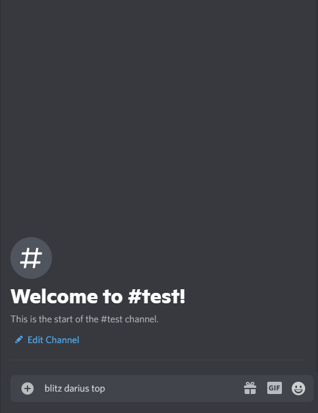

# RileyBot

Discord Bot written in Java using the [JDA](https://github.com/DV8FromTheWorld/JDA) Discord API wrapper.

  
Commands

  ## Commands
  

  
Stocks Command

 
  ### Description
  Uses the [Finnhub](https://finnhub.io/) and [Messari](https://messari.io/) APIs to search for and display stock/crypto currency prices.
  
  [View code](src/main/java/Command/Commands/StocksCommand.java)

  ### Usage
  `$query` where `query` is a stock/crypto symbol, company name, or ID.

  Alternatively, `$stock query` or `$crypto query` may be used to search specifically for stock or crypto.

  If a singular matching symbol is found, the market data for that symbol is displayed, otherwise a pageable message containing the search results will be shown.

  #### Example(s)
  
  
  

  

  
Blitz Command

 
  ### Description
  Uses the [Blitz.gg](https://blitz.gg/) API to display League of Legends champion build data.
  
  [View code](src/main/java/Command/Commands/BlitzCommand.java)

  ### Usage
  `blitz [champion] [role]` where `champion` is the name of a champion and `role` is the name of a role.

  #### Example(s)
  
  

    

  
Match History Command

 
  ### Description
  Uses the [COD API](https://github.com/Lierrmm/Node-CallOfDuty) to display a player's match history in Modern Warfare/Cold War.
  
  [View code](src/main/java/Command/Structure/MatchHistoryCommand.java)

  ### Usage
  `[platform] [trigger] [name] [match ID]` where `platform` is one of `XBOX, XBL, PSN, BATTLE` (optional & assumed to be Battle.net), `trigger` is one of `mwhistory, cwhistory` (depending on the game), `name` is the player name to search, and `match ID` is optional however when specified will display the player's stats for a specific match.

  #### Example(s)
  
  
  

