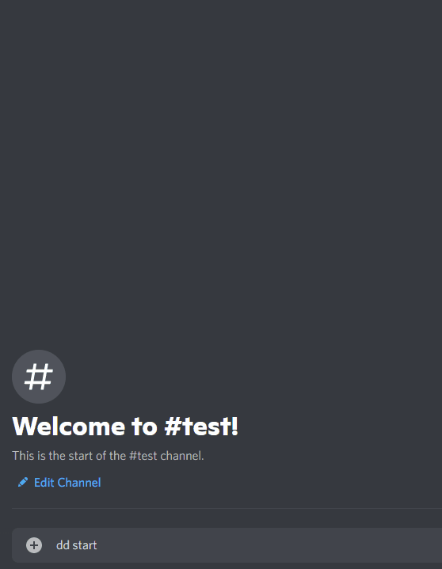
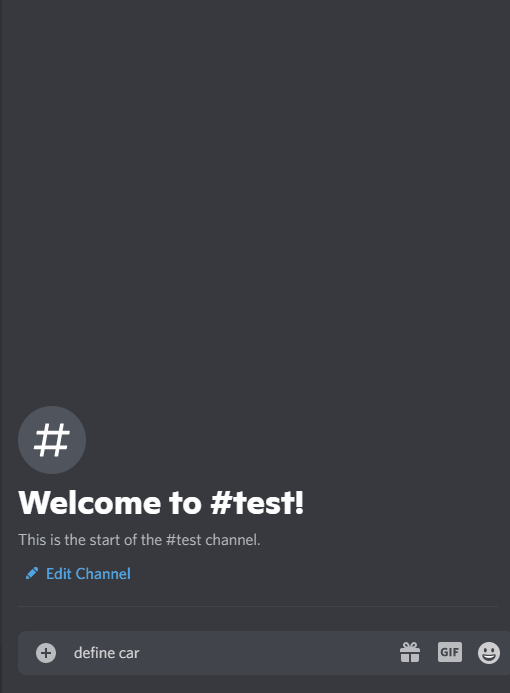

# RileyBot

Discord Bot written in Java using the [JDA](https://github.com/DV8FromTheWorld/JDA) Discord API wrapper.

  
Command Examples

  ## Commands
  

  
Stocks Command

 
  ### Description
  Uses the [Finnhub](https://finnhub.io/) and [Messari](https://messari.io/) APIs to search for and display stock/crypto currency prices.
  
  [View code](src/main/java/Command/Commands/StocksCommand.java)

  ### Usage
  `$query` where `query` is a stock/crypto symbol, company name, or ID.

  Alternatively, `$stock query` or `$crypto query` may be used to search specifically for stock or crypto.

  If a singular matching symbol is found, the market data for that symbol is displayed, otherwise a pageable message containing the search results will be shown.

  #### Example(s)
  
  
  

  

  
Blitz Command

 
  ### Description
  Uses the [Blitz.gg](https://blitz.gg/) API to display League of Legends champion build data.
  
  [View code](src/main/java/Command/Commands/BlitzCommand.java)

  ### Usage
  `blitz [champion] [role]` where `champion` is the name of a champion and `role` is the name of a role.

  #### Example(s)
  
  

    

  
Match History Command

 
  ### Description
  Uses the [COD API](https://github.com/Lierrmm/Node-CallOfDuty) to display a player's match history in Modern Warfare/Cold War.
  
  [View code](src/main/java/Command/Structure/MatchHistoryCommand.java)

  ### Usage
  `[platform] [trigger] [name] [match ID]` where `platform` is one of `XBOX, XBL, PSN, BATTLE` (optional & assumed to be Battle.net), `trigger` is one of `mwhistory, cwhistory` (depending on the game), `name` is the player name to search, and `match ID` is optional however when specified will display the player's stats for a specific match.

  #### Example(s)
  
  
  

    

  
Deal or No Deal Command

 
  ### Description
  Play a game of Deal or No Deal using a programmatically built image as the UI.
  
  [View code](src/main/java/Command/Commands/DealOrNoDealCommand.java)

  ### Usage
  `dd start` to begin a game
  
  `dd select [case #]` to select your case
  
  `dd open [case #]` to open a case
  
  `dd [deal/no deal]` to make/deny a deal
  
  `dd forfeit` to end a game
 
  #### Example(s)
  
  

   

  
Dictionary Command

 
  ### Description
  Uses the Merriam-Webster dictionary to display definitions of a given word, pairs the definition with a random image found using the [Unsplash API - Search photos by keyword endpoint](https://unsplash.com/documentation#search-photos) (with the dictionary word as the keyword).
  
  [View code](src/main/java/Command/Commands/DictionaryCommand.java)

  ### Usage
  `define [word]` where `word` is the word to find in the dictionary.
  If more than one word is found, the results will be displayed in a pageable message.

  #### Example(s)
  
  
  

     

  
Grand Exchange Command

 
  ### Description
  Uses the [OSRS Wiki Grand Exchange API](https://oldschool.runescape.wiki/w/RuneScape:Real-time_Prices) to search for & display item prices.
  
  [View code](src/main/java/Command/Commands/GrandExchangeCommand.java)

  ### Usage
  `g.e [query]` where `query` is either the name or ID of an item.
  If more than one item is found, the results will be displayed in a pageable message.

  #### Example(s)
  
  
  

       

  
Gunfight Command

 
  ### Description
  Win/loss tracker for Modern Warfare. Buttons are used to add wins & losses, results are saved to a leaderboard.
  
  [View code](src/main/java/Command/Commands/Passive/GunfightCommand.java)

  ### Usage
  `gunfight!` to begin a session or to re-send the tracker message.
         
  `leaderboard!` to view the leaderboard.
         
  `leaderboard! [#]` to view a specific session from the leaderboard.

  #### Example(s)
  
  
 

         

  
Hangman Command

 
  ### Description
  Play a game of Hangman using a programmatically built image as the UI. The gallows is randomly selected from a variety of options. Either choose a word to play or get the bot to pick one from the dictionary.
  
  [View code](src/main/java/Command/Commands/HangmanCommand.java)

  ### Usage
  `hm start [word]` to start a game using the given `word`.
           
  `hm ai` to start a game with a word the bot picks from the dictionary.
           
  `hm stop` to forfeit the game.
  
  `hm hint` to unlock a letter in the word.

  #### Example(s)
  
 

           

  
LOL Lookup Command

 
  ### Description
 Look up a player's League of Legends stats and build an image displaying them.
  
  [View code](src/main/java/Command/Commands/Lookup/LOLLookupCommand.java)

  ### Usage
  `[region] lollookup [name]` where `region` is the optional region code e.g `oce` (region is assumed to be oce), and `name` is the player's summoner name.  
  
  #### Example(s)
  
 

           

  
Execute Order 66 Command

 
  ### Description
This command uses a role named `target`.
             
This role is applied to all members when they join and may be manually added/removed as with any role.
             
Typing `kill list` will send a private message to the user displaying the list of members who are targeted.
             
By typing `execute order 66`, the bot will join the voice channel and play a random audio clip before kicking all members on the list. (Members who the bot cannot kick will be removed from the list prior to executing).
             
Kicked members will be sent a message with an invite back to the server.
  
  [View code](src/main/java/Command/Commands/ExecuteOrder/ExecuteOrder66Command.java)

  ### Usage
`kill list` to view targeted members.
             
`execute order 66` to kick the targeted members.
  
  #### Example(s)

  https://user-images.githubusercontent.com/42688609/122846622-5c0ff880-d35a-11eb-9420-842282f0c7d4.mp4
             
  

 

             

  
Millionaire Command

 
  ### Description
This command allows the user to play a game of Who Wants to Be a Millionaire.
Buttons are used to answer questions/use the lifeline and winnings are saved in to a bank which is ranked on a leaderboard.
               
The questions are retrieved from the [Open Trivia DB](https://opentdb.com/) and are of random difficulty/topics.
  
  [View code](src/main/java/Command/Commands/MillionaireCommand.java)

  ### Usage
`millionaire start` to start the game.
               
`millionaire forfeit` to forfeit the game (keeping the winnings up until that point).
               
`millionaire bank` to view your bank.
               
`millionaire bank [@someone]` to view another member's bank (where `@someone` is the @mention of another member).
               
`millionaire leaderboard` to view the bank leaderboard
  
  #### Example(s)
             
  
  
  

 

